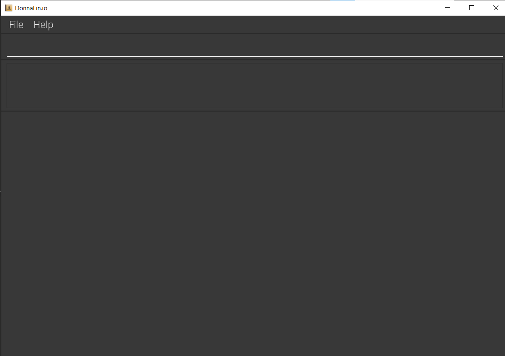
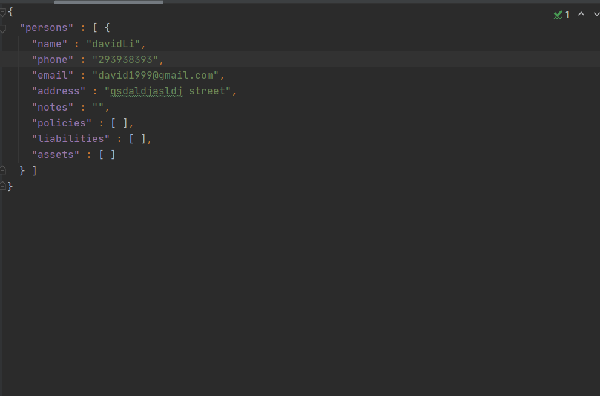

DonnaFin.io is a desktop application used by financial advisors to keep track of their 
client information and related tasks. This is a Java program with about 10 kloc with 
a JavaFX GUI. The '.io' in our name is a reflection of our belief that you deserve a 
faster workflow for input and output. If you can type fast, you can use our CLI-like 
commands to manage your client information and view your notes much faster 
than your typical customer relationship manager apps.

Note: From here on we shall refer to DonnaFin.io as DonnaFin for your readability.

* Table of Contents
{:toc}

--------------------------------------------------------------------------------------------------------------------

## Quick start

1. Ensure you have Java `11` or above installed in your Computer.

1. Download the latest `donnafin.jar` from [here](https://github.com/AY2122S1-CS2103T-W16-1/tp/releases).

1. Copy the file to the folder you want to use as the _home folder_ for your DonnaFin app.

1. Double-click the file to start the app. The GUI similar to the below should appear in a few seconds. Note how the app contains some sample data. 
   

1. Type the command in the command box and press Enter to execute it. e.g. typing **`help`** and pressing Enter will open the help window. 
   Some example commands you can try:

   * **`list`** : Lists all contacts.

   * **`add`**`n/John Doe p/98765432 e/johnd@example.com a/John street, block 123, #01-01` : Adds a contact named `John Doe` to the DonnaFin.

   * **`delete`**`3` : Deletes the 3rd contact shown in the current list.

   * **`clear`** : Deletes all contacts.

   * **`exit`** : Exits the app.

1. Refer to the [Features](#features) below for details of each command.

--------------------------------------------------------------------------------------------------------------------

## Features

**:information_source: Notes about the command format:** 

* Words in `UPPER_CASE` are the parameters to be supplied by the user. 
  e.g. in `add n/NAME`, `NAME` is a parameter which can be used as `add n/John Doe`.

* Parameters can be in any order. 
  e.g. if the command specifies `n/NAME p/PHONE_NUMBER`, `p/PHONE_NUMBER n/NAME` is also acceptable.

* If a parameter is expected only once in the command but you specified it multiple times, only the last occurrence of the parameter will be taken. 
  e.g. if you specify `p/12341234 p/56785678`, only `p/56785678` will be taken.

* The format given for monetary parameters includes `$`, you should add it or the input will be rejected.  
  e.g. A valid input for `v/$ASSET_VALUE` is `v/$1000`. `v/1000` will not be accepted by DonnaFin.

### Global Commands
These commands can be accessed from any window of DonnaFin.

#### Viewing help : `help`

Shows a message explaining how to access the help page.

Format: `help`

#### Exiting the program : `exit`

Exits the program.

Format: `exit`

### Home Window Commands

These commands are exclusive to Home Window the default 
window that pops up when DonnaFin is opened.

#### Adding a Client : `add`

Adds a person to the DonnaFin.

Format: `add n/NAME p/PHONE_NUMBER e/EMAIL a/ADDRESS`

Examples:
* `add n/John Doe p/98765432 e/johnd@example.com a/John street, block 123, #01-01`
* `add n/Betsy Crowe e/betsycrowe@example.com a/Newgate Prison p/1234567`

#### Deleting a Client : `delete`

Deletes the specified person from the DonnaFin.

Format: `delete INDEX`

* Deletes the person at the specified `INDEX`.
* The index refers to the index number shown in the displayed person list.
* The index **must be a positive integer** 1, 2, 3, …​

Examples:
* `list` followed by `delete 2` deletes the 2nd person in the DonnaFin.
* `find Betsy` followed by `delete 1` deletes the 1st person in the results of the `find` command.

#### Listing All Clients : `list`

Shows a list of all persons in the DonnaFin.

Format: `list`

#### Locating Clients by Name: `find`

Finds persons whose names contain any of the given keywords.

Format: `find KEYWORD [MORE_KEYWORDS]`

* The search is case-insensitive. e.g `hans` will match `Hans`
* The order of the keywords does not matter. e.g. `Hans Bo` will match `Bo Hans`
* Only the name is searched.
* Only full words will be matched e.g. `Han` will not match `Hans`
* Persons matching at least one keyword will be returned (i.e. `OR` search).
  e.g. `Hans Bo` will return `Hans Gruber`, `Bo Yang`

Examples:
* `find John` returns `john` and `John Doe`
* `find alex david` returns `Alex Yeoh`, `David Li` 
  

#### Clearing all entries : `clear`

Clears all entries from the DonnaFin.

Format: `clear`

#### View Client Information : `view`

Access client information in a 'client view' mode where all data on the client is presented to you. Once in the page, you can see each field in detail and edit existing information.

Format: view INDEX

* Edits the client at the specified INDEX. The index refers to the index number shown in the displayed person list. 
* The index **must be a positive integer** 1, 2, 3, ...​
* The view screen will switch to the client window.

Examples:
* `view 1`
* This will open a new view mode, where the client's data is present in field-value pairs as such:
* 
* The information related to the client is separated to different tabs.
* Each tab contains information closely related to the title of the tab.

### Client Window Commands

These commands are exclusive to client window. They give access and writing privileges for any client information
fields. You can access these commands once you have entered the Client Window using our `view` command.

#### Switching Tabs : `tab`

Allows user to navigate to a different tab.
* There are 5 tabs: Contacts, Policies, Assets, Liabilities and Notes.

Format: `tab KEYWORD`

##### Contacts Tab

Switches from any tab in Client Window to `Contact` tab.

Keywords: `c`, `contact` or `contacts` (case insensitive)

Examples:
* `tab c`
* `tab contact`

##### Policies Tab

Switches from any tab in Client Window to `Policies` tab.

Keywords: `p`, `policy` or `policies` (case insensitive)

Examples:
* `tab p`
* `tab policy`

##### Assets Tab

Switches from any tab in Client Window to `Assets` tab.

Keywords: `a`, `asset` or `assets` (case insensitive)

Examples:
* `tab a`
* `tab asset`

##### Liabilities Tab

Switches from any tab in Client Window to `Liabilities` tab.

Keywords: `l`, `liability` or `liabilities` (case insensitive)

Examples:
* `tab l`
* `tab liability`

##### Notes Tab

Switches from any tab in Client Window to `Notes` tab.

Keywords:  `n`, or `note` or `notes` (case insensitive)

Examples:
* `tab n`
* `tab note`

#### Edit Contacts: `edit`

Edit your client field in contacts. You should be in `Contacts` tab to use these commands.

##### Edit Client Name

Edits the name of the client you are currently viewing.

Format: `edit n/NAME`

Example: `edit n/Allison Wang`

##### Edit Client Phone Number

Edits the phone number of the client you are currently viewing.

Format: `edit p/PHONE_NUMBER`

Example: `edit p/81753076`

##### Edit Client Address

Edits the address of the client you are currently viewing.

Format: `edit a/ADDRESS`

Example: `edit a/#12-123 Phua Chu Kang Ave 7`

##### Edit Client Email

Edits the email of the client you are currently viewing.

Format: `edit e/EMAIL`

Example: `edit e/allison@gmail.com`

#### Add an Asset: `append`

Adds a new asset to the current client you are viewing. You must be in the `Assets` tab.

* `$ASSET_VALUE` is a monetary value. DonnaFin will only accept whole numbers and
  values in 2 decimal places (i.e. $120 and $120.20 are valid. $120.2 is invalid).

Format: `append n/ASSET_NAME ty/ASSET_TYPE v/$ASSET_VALUE r/REMARKS_ON_ASSET`

Example:
* `append n/Good Class Bungalow ty/Property v/$10000000 r/newly bought with bank loan`

#### Remove an Asset: `remove`

Remove an existing asset from the current client you are viewing. You must be in the `Assets` tab.

* Removes the asset at the specified `INDEX`.
* The index refers to the index number shown in the displayed asset list.
* The index **must be a positive integer** 1, 2, 3, …​

Format: `remove INDEX`

Example:
* `remove 1`

#### Add a Liability: `append`

Adds a new liability to the current client you are viewing. You must be in the `Liabilities` tab.

* `$LIABILITY_VALUE` is a monetary value. DonnaFin will only accept whole numbers and
  values in 2 decimal places (i.e. $120 and $120.20 are valid. $120.2 is invalid).

Format: `append n/LIABILITY_NAME ty/LIABILITY_TYPE v/$LIABILITY_VALUE r/REMARKS_ON_LIABILITY`

Example:
* `append n/Property debt with DBS ty/debt v/$100000 r/10% annual interest`

#### Remove a Liability: `remove`

Remove an existing liability from the current client you are viewing. You must be in the `Liabilities` tab.

* Removes the liability at the specified `INDEX`.
* The index refers to the index number shown in the displayed liability list.
* The index **must be a positive integer** 1, 2, 3, …​

Format: `remove INDEX`

Example:
* `remove 1`

#### Add a Policy: `append`

Adds a new policy to the current client you are viewing. You must be in the `Policies` tab.

* `$INSURED_VALUE`, `$YEARLY_PREMIUM` and `$COMMISSION` are monetary values. DonnaFin will only accept whole numbers and
values in 2 decimal places (i.e. $120 and $120.20 are valid. $120.2 is invalid).

Format: `append n/POLICY_NAME i/INSURER iv/$INSURED_VALUE pr/$YEARLY_PREMIUM c/$COMMISSION`

Example:
* `append n/Diamond Policy i/AIA iv/$10000 pr/$200 c/$1000`

#### Remove a Policy: `remove`

Remove an existing policy from the current client you are viewing. You must be in the `Policies` tab.

* Removes the liability at the specified `INDEX`.
* The index refers to the index number shown in the displayed policy list.
* The index **must be a positive integer** 1, 2, 3, …​

Format: `remove INDEX`

Example:
* `remove 1`

#### Edit Notes

You can simply add your changes inside the notes field inside `Notes` tab and DonnaFin will automatically save your data.

#### Returning to Home Window: `home`

Allows the user to return to the home window.

Format: `home`

### Saving the data

DonnaFin data are saved in the hard disk automatically after any command that changes the data. There is no need to save manually.

### Editing the data file

DonnaFin data are saved as a JSON file `[JAR file location]/data/addressbook.json`. Advanced users are welcome to update data directly by editing that data file.

:exclamation: **Caution:**
If your changes to the data file makes its format invalid, DonnaFin will discard all data and start with an empty data file at the next run.

Original AddressBook format           |  Invalid Addressbook format due to direct editting
:-------------------------:|:-------------------------:
 | 

As seen in the above side by side comparsion, the first figure show the original .json data 
regarding the client Alex Yeoh. All attributes are in the correct format. However, if you do tamper with the 
json file directly and change one of the attributes to an invalid format, in this case the 
total value of assets(supposed to be prefixed with a $ to indicate that it is a monetary value), DonnaFin will
discard all the data and start with an empty data file as seen below.
When this happens however, to prevent total loss of your data, we do not delete it right away.

DonnaFinGui           |  Addressbook.json
:-------------------------:|:-------------------------:
 | 

The follow error message is displayed as well:

When this happens however, to prevent total loss of your data, we do not delete it right away.

Only when a new add command is run, will DonnaFin assume this is the intended action and proceed to cleanly wipe
the addressbook.json and populate with the new client as seen below.

DonnaFinGui           |  Addressbook.json
:-------------------------:|:-------------------------:
 | 

--------------------------------------------------------------------------------------------------------------------

## FAQ

**Q**: How do I transfer my data to another Computer? 
**A**: Install the app in the other computer and overwrite the empty data file it creates with the file that contains the data of your previous DonnaFin home folder.

**Q**: I have multiple clients with the same name, but your application won't let me add them! What do I do? 
**A**: We realise some names are common, but we decided to prioritise your ability to instantly recognise a client over letting you keep the accuracy of the name. For that reason, we suggest adding other identifying nicknames or words in the name e.g. "John Walker (Bartender)" and "John Walker (Johnny)".

**Q**: My clients have assets and policies valued in USD / RMB / AUD / other currency. How can I show this in the table? 
**A**: We plan to have multi-currency support in future developments. However, currently we only accept dollar ('$') currencies and formats that are compatible with the Singapore Dollar. For now, please use only a single currency and convert as appropriate.

**Q**: I want to write with non-latin alphabets. Do you have support for internationalization (e.g. Chinese, Hindi, Malay) 
**A**: While it may not break our system, we have developed this application with latin script in mind, and cannot guarantee a bug-free experience.

--------------------------------------------------------------------------------------------------------------------

## Command summary

| Action     | Format                                                                | Examples
| ---------- | --------------------------------------------------------------------- | -------------------------------------------------------------------------------------------------- |
| **Add**    | `add n/NAME p/PHONE_NUMBER e/EMAIL a/ADDRESS`                | `add n/James Ho p/22224444 e/jamesho@example.com a/123, Clementi Rd, 1234665`
| **Clear**  | `clear`                                                                | `clear`
| **Delete** | `delete`                                                               | `delete 3`
| **Edit Name**   | `edit n/NAME` | `edit n/James Lee`
| **Edit Address**   | `edit a/ADDRESS` | `edit a/blk 123 bukit batok ave 4`
| **Edit Email**   | `edit e/EMAIL` | `edit e/jameslee@donnafin.com`
| **Edit Phone Number**   | `edit p/PHONE_NUMBER` | `edit p/98374283`
| **View**   | `view INDEX`                                                           | `view 2`
| **Find**   | `find KEYWORD`                                                         | `find James Jake`
| **List**   | `list`                                                                 | `list`
| **Help**   | `help`                                                                 | `help`
| **Home**   | `home`                                                                 | `home`
| **View**   | `view INDEX`                                                                 | `view 1`
| **Append Asset**   | `append n/ASSET_NAME ty/ASSET_TYPE v/$ASSET_VALUE r/REMARKS_ON_ASSET`| `append n/Good Class Bungalow ty/Property v/$10000000 r/newly bought with bank loan`
| **Append Liability**   | `append n/LIABILITY_NAME ty/LIABILITY_TYPE v/$LIABILITY_VALUE r/REMARKS_ON_LIABILITY`| `append n/Property debt with DBS ty/debt v/$100000 r/10% annual interest`
| **Append Policy**   | `append n/ASSET_NAME ty/ASSET_TYPE v/$ASSET_VALUE r/REMARKS_ON_ASSET`| `append n/Good Class Bungalow ty/Property v/$10000000 r/newly bought with bank loan`
| **Remove Asset/Liability/Policy**   | `remove INDEX`                                                                 | `remove 1`
| **Switch to Contacts tab**   | `tab KEYWORD`                                                                 | `tab c`
| **Switch to Policies tab**   | `tab KEYWORD`                                                                 | `tab p`
| **Switch to Assets tab**   | `tab KEYWORD`                                                                 | `tab a`
| **Switch to Liabilities tab**   | `tab KEYWORD`                                                                 | `tab l`
| **Switch to Notes tab**   | `tab KEYWORD`                                                                 | `tab n`
