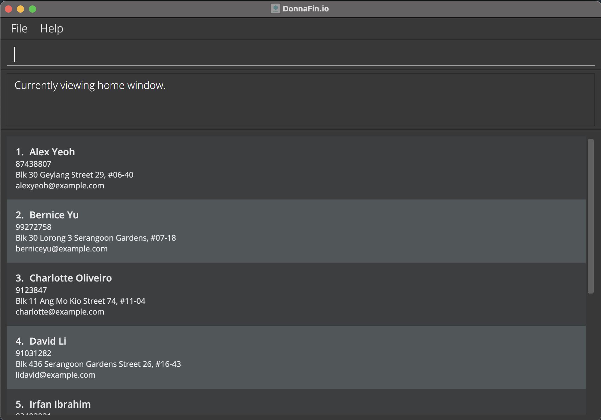
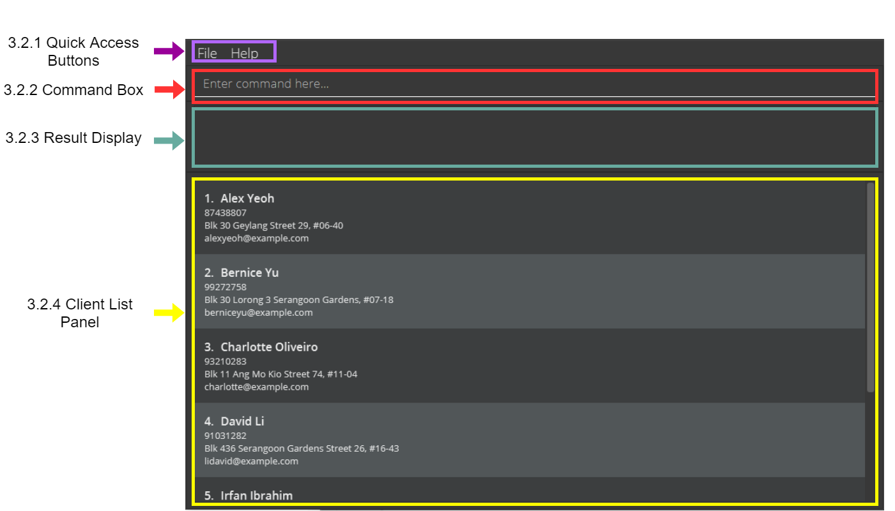
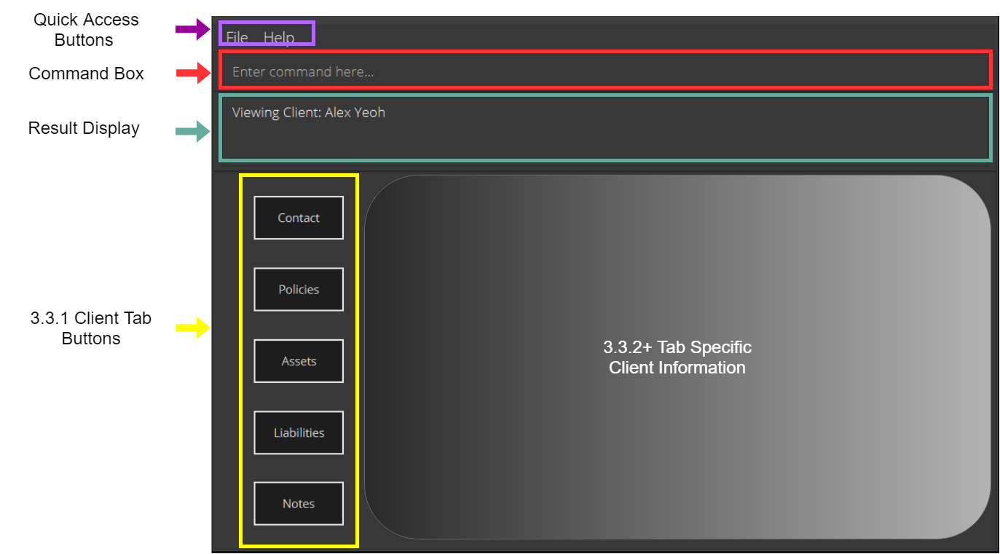
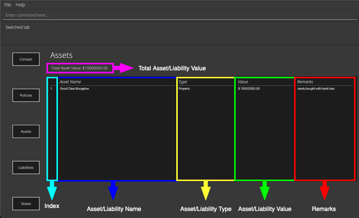
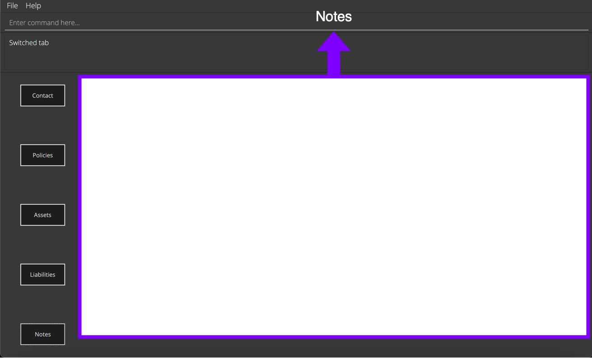
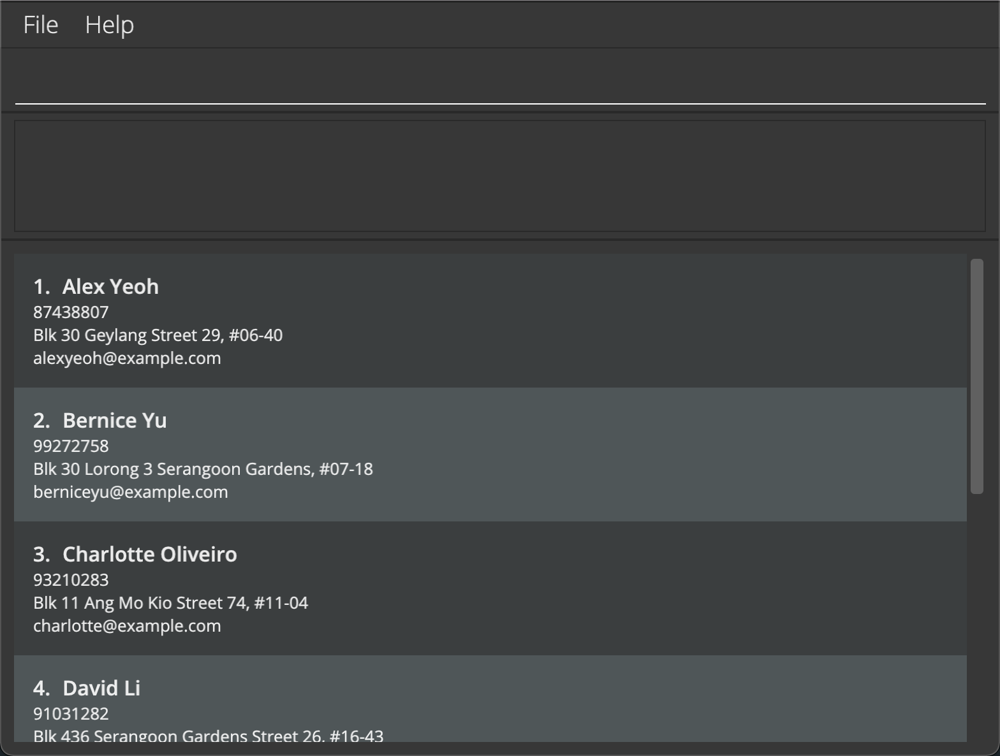
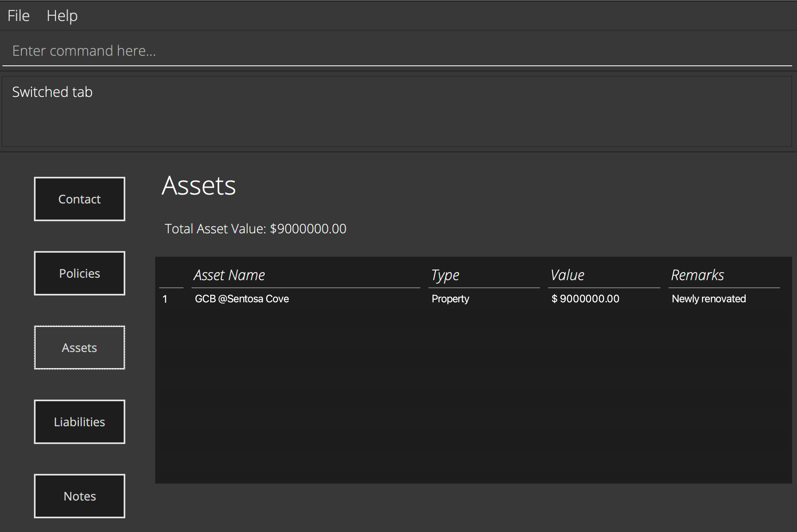
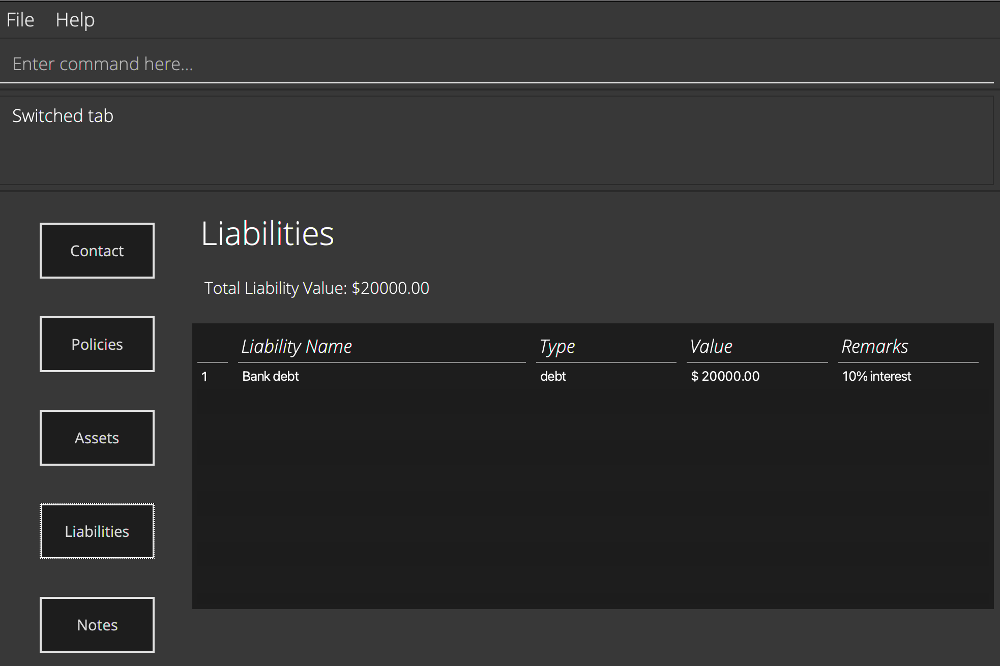
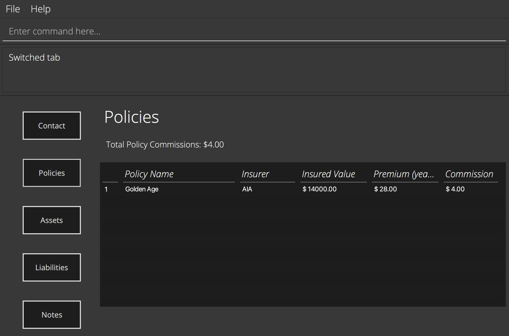

* Table of Contents
{:toc}

--------------------------------------------------------------------------------------------------------------------
## 1. Introduction


DonnaFin.io is a desktop application used by financial advisors to keep track of their
client information and related tasks. The '.io' in our name is a reflection of our belief
that you deserve a faster workflow for input and output. If you can type fast,
you can use our [CLI-like](#7-glossary) commands to manage your client information
and view your notes much faster than your typical customer relationship manager apps.

Note: From here on we shall refer to DonnaFin.io as DonnaFin for your readability.

### 1.1 Is this guide for you?

Are you a new user who is looking to get started with using DonnaFin? Perhaps you are a more
advanced user trying to refresh your understanding of the available commands? Look no further!
This is the guide that will kickstart your journey as a DonnaFin whizz and even be your go-to
reference if you need to refresh your understanding on some features.
Head over to [Quick Start](#2-quick-start) or [Features](#4-features) for more information.

### 1.2 How to use the user guide

As most applications on the market are not CLI-based, this may come across
as new to some users. We strongly recommend that first-time users read through the user guide to gain a basic understanding
of how to use our app. We have also included links to navigate around the user guide to allow easier access
of related information. Some tips and tricks, as well as cautions are included throughout the guide to
help you get more out of our application. Additionally, links back to the top of the page
like below are present at the end of every section. For easier navigation around this User Guide, we suggest using our table of contents together with these
links to quickly find and access the information you need.

This marks the end of the Introduction. Click
<a href="#top">here</a> to return to the top

--------------------------------------------------------------------------------------------------------------------

## 2. Quick start

1. Ensure you have Java `11` or above installed in your Computer.

1. Download the latest `donnafin.jar` from [here](https://github.com/AY2122S1-CS2103T-W16-1/tp/releases).

1. Copy the file to the folder you want to use as the _home folder_ for your DonnaFin app. Using an empty folder is
   recommended to reduce confusion and conflict between data and user preference generated by our application.

1. Double-click the file to start the app. The GUI similar to the below should appear in a few seconds. Note
   that DonnaFin comes with some sample clients.<br> 

1. Type the command in the command box and press Enter to execute it. e.g. typing **`help`** and pressing Enter will open the help window.<br>
   Some example commands you can try:

   * **`list`** : Lists all clients.

   * **`add`**`n/John Doe p/98765432 e/johnd@example.com a/John street, block 123, #01-01` : Adds a client named `John Doe` to the DonnaFin.

   * **`view`**`3` : Opens the client window, where you can access the details of the 3rd client shown in the current list.

   * **`tab`**`a` : Access the assets tab of client that is currently viewed.

   * **`append`**`n/Good Class Bungalow ty/Property v/$10000000 r/newly bought with bank loan` :
   As we are in the Asset tab now, this will add an asset to the currently viewed client.
   * **`remove`**`1` : Removes the 1st asset in the Asset tab.

   * **`home`** : Return to home window.

   * **`delete`**`3` : Deletes the 3rd client shown in the current list.

   * **`exit`** : Exits the DonnaFin.

1. Refer to the [Features](#4-features) below for details of each command.

This marks the end of the Quick Start section. Click
<a href="#top">here</a> to return to the top

--------------------------------------------------------------------------------------------------------------------

## 3. About

This section aims to help familiarize you with how our application works as well as the terminology that we use
throughout our application and user guide.

### 3.1 Special Icons

Here are the special icons used throughout our User Guide to help you utilise this guide more effectively.

#### Tips

Tips are tidbits of helpful information that can help you have a better experience with DonnaFin.

<div markdown="span" class="alert alert-primary">:bulb:
**Tip:** Tips are helpful!
</div><br>

#### Notes

Notes are here to provide you with extra information that you may find useful when using DonnaFin.

<div markdown="span" class="alert alert-primary">:information_source:
**Note:** Take notes when you see this icon!
</div><br>

#### Caution

Cautions are around to warn you of potential pitfalls that unfamiliar users may encounter. For example, if you fail
to heed warnings around commands like `clear` or tamper with application files without adequate knowledge, you may
inadvertently lose data permanently.

<div markdown="span" class="alert alert-warning">
:exclamation: Here lies a cautionary tale!
</div><br>

### 3.2 Application Home Window Breakdown

Here is an overview of the different elements that makes up the Home Window of DonnaFin



#### 3.2.1 Quick Access Buttons
* This area gives you access to the 'File' button that allows you to quickly exit the app, and the help
  button that redirects you to the User Guide for further guidance.

#### 3.2.2 Command Box
* The command box is where you can enter a command where you can hit enter to execute it.

#### 3.2.3 Result Display
* The result display is where the response to the command entered is displayed.
* In the event you enter an invalid or wrongly formatted command, the error message will be displayed here as well.

#### 3.2.4 Client List Panel
In this section, you will be able to view a list of all the clients that have their records stored on DonnaFin. The index
of a client corresponds to the index needed to be entered in the `view` command. For example: if the client list is as
per the image above, entering the input `view 2` would take you to the client window of Bernice Yu, as she has the index
of 2.

The following client details are also viewable from the Client List Window:
1. Name
2. Phone
3. Address
4. Email Address

### 3.3 Application Client Window Breakdown

Using the `view` command brings you to the client window. Though the client window differs in content and layout
from the main window, the 'Quick Access Button', 'Command Box' and 'Result Display' are all the same as explained
earlier in section 3.2.

Here is a picture showing all the common elements spread across all tabs in the Client View.



#### 3.3.1 Client Tab Buttons
* These buttons are specific to the Client Window, and you can use these buttons to toggle through the different tabs
  to access and edit client information. The tabs are as follows:
  1. Contact
  2. Policies
  3. Assets
  4. Liabilities
  5. Notes

The tabs can also be toggled through using the `tab` command as shown [here](https://ay2122s1-cs2103t-w16-1.github.io/tp/UserGuide.html#431-switching-tabs-in-client-window-tab).

#### 3.3.2 Contact Tab
The Contact Tab is the Client Window tab you first see when transitioning from the Home View to the Client View.
Alternatively, this tab can also be accessed by pressing on the `Contact` button when in any of the Client View tabs,
or through typing the command `tab c`, `tab contact` or `tab contacts`. You can access the following contact details of
your client:
1. Name
2. Phone
3. Email
4. Address

The picture below shows how these are displayed:


The Contact tab also supports the `edit` that allows you to change any of your client's contact details as
shown [here.](https://ay2122s1-cs2103t-w16-1.github.io/tp/UserGuide.html#432-edit-clients-contact-information-edit)

#### 3.3.3 Policies Tab
The Policies Tab is the Client View tab that stores all of your client's policies. This tab could be accessed by pressing on
the **Policies** button when in any of the Client View tabs, or by typing the command `tab p`, `tab policy` or `tab policies`.

You will know that you are in the Policy tab if you see the **Policies** header below the Result Display. You can access the total
commission that you have earned through looking at the number to the right of the **Total Policy Commissions**.

The table displays each policy in its own row, with each field of the policy (e.g. insurer, commission) displayed in columns.


Here are the following fields that each policy records:
1. Policy Name
2. Insurer
3. Insured Value
4. Yearly Premium
5. Commission

Each policy has an index which is sorted by ascending order, and if you would like to remove an existing policy, you can
use its index as a parameter for `delete`. To save you the effort of counting rows, we have indexed the rows with a counter
on the leftmost column.


The Policies tab also supports the `append` and `remove` command that allows you to add a new policy or
remove an existing policy as shown
[here](https://ay2122s1-cs2103t-w16-1.github.io/tp/UserGuide.html#435-policy-features).

#### 3.3.4 Asset/Liabilities Tab

###### This section covers both the asset and liability tab due to their similarities.

The Asset/Liabilities tab is the Client View tab that stores all of your client's assets/liabilities. This tab can be
accessed by pressing on the `Assets/Liabilities` button when in any of the Client View tabs, or through typing the
command `tab a`, `tab asset`, or `tab assets` for the Assets tab and typing the command `tab l`, `tab liability`, or
`tab liabilities` for the Liabilities tab.

You will know that you are in the Assets tab if you see the **Assets** header below the Result Display or the
Liabilities tab if you see the **Liabilities** header below the Result Display. You can see the total value of these
assets/liabilities by looking at the number beside the **Total Asset/Liability Value**.

The table displays each asset / liability in a row with each field of the asset / liability displayed in columns.



Here are the following fields that each asset/liability records:
1. Index
2. Asset/Liability Name
3. Asset/Liability Type
4. Asset/Liability Value
5. Remarks

Each asset/liability has an index which is sorted by ascending order, and if you would like to remove an existing
asset/liability, you can use its index as a parameter for `delete`. To save you the effort of counting rows, we have
indexed the rows with a counter on the leftmost column.

The Asset/Liability tab also supports the `append` and `remove` command that allows you to add a new asset/liability or
remove an existing asset/liability as shown [here](#4331-add-an-asset-to-a-client-append).

#### 3.3.5 Notes Tab

The Notes tab stores additional information about your client. This tab can be accessed by pressing on the `Notes`
button when in any of the Client View tabs, or through typing the command `tab n`, `tab note` or `tab notes`.

You will know that you are in the Notes tab if you see a big white text box below the Result Display. You may simply
type into it, and all the edits you make will be saved. Unlike the command box, this supports multi-line input and
allows you to indent lines with spaces.



### 3.4 Command Format

In DonnaFin, we provide the user with a Command-Line-Input (or CLI). The command message is generally in the format of a
`COMMAND_WORD` followed optionally by a number of parameters (`COMMAND_WORD PARAMETER1 PARAMETER2 PARAMETER3`).

The `COMMAND_WORD` directly describes the intent (e.g. `add`, `delete`, `view`).
The optional parameters are additional information that may be required by the command. For example, `delete` requires
one parameter — the index of the client being listed, so the full command would be `delete 1`

Command syntax takes these three possible forms:

* Commands that do not require parameters (e.g. `list`, `home`)
* Commands that require 1 parameter (e.g. `view 1`, `delete 1`, `find pat`)
* Commands that require more than 1 parameter. In these cases, parameters must always be prefixed and order does not
  matter. (e.g. `add n/John McClane e/mcclane@notnakatomi.com a/3 Mountain View Rd, SG 244220 p/90249024`)

<div markdown="block" class="alert alert-info">

**:information_source: Notes about the command format:**<br>

* Command word is **case-insensitive**.<br>
  e.g. in `remove 3`, command word `remove` can be accepted as `Remove` or `rEmOvE`.

* Words in `UPPER_CASE` are the parameters to be supplied by the user.<br>
  e.g. in `edit n/NAME`, `NAME` is a parameter which can be used as `edit n/John Doe`.

* Parameters can be in any order.<br>
  e.g. if the command specifies `n/NAME p/PHONE_NUMBER`, `p/PHONE_NUMBER n/NAME` is also acceptable.

* To make things easier to remember for the user, we have also chosen prefixes that closely resemble the field to be 
  added to (e.g. `n/` for name and `pr/` for premium).

* Items in square brackets are optional.<br>
  e.g. `KEYWORD [MORE_KEYWORDS]` can be used as `KEYWORD MORE_KEYWORDS` or as `KEYWORD`.

* If a parameter is expected only once in the command, but you specified it multiple times, only the last occurrence
  of the parameter will be taken.<br> e.g. if you specify `p/12341234 p/56785678`, only `p/56785678` will be taken.

* The format given for monetary parameters includes `$`, you should add it or the input will be rejected. <br>
  e.g. A valid input for `v/$ASSET_VALUE` is `v/$1000`. `v/1000` will not be accepted by DonnaFin. As we currently
  only accept dollar formats, cents can be added by specifying the value to two decimal points.
</div>


This marks the end of the About section. Click <a href="#top">here</a> to return to the top

--------------------------------------------------------------------------------------------------------------------

## 4. Features

This section gives you a detailed explanation on how each of our features work.

For your easy reference and navigation, we have split our features into _four different categories_:
1. [Global Features](#41-global)
2. [Home Window Features](#42-home-window)
3. [Client Window Features](#43-client-window)
4. [Database Features](#44-database)

The following categories will explain the intended purpose of our features.

### 4.1 Global
Global commands consists of features that can be accessed from any (Home or Client) window of DonnaFin.
Such features include getting help and exiting DonnaFin.

#### 4.1.1 Viewing help : `help`

Shows a message explaining how to access the help page.


Format: `help`

#### 4.1.2 Exiting the program : `exit`

Exits the program.

Format: `exit`

### 4.2 Home Window

Home Window commands consists of features that enables you to manage your client base.
These features are exclusive to [Home Window](#32-application-home-window-breakdown), the default window that pops up when DonnaFin is opened.

**The Home Window:**


Such features include adding and deleting clients, listing/clearing all clients, doing a specific search for clients,
as well as viewing a client in detail.

<div markdown="span" class="alert alert-primary">
:information_source: **Note:**
To access and update details on a specific client, you may refer to [Client Window Commands](#43-client-window).
</div>

#### 4.2.1 Adding a Client : `add`

Adds a client to the DonnaFin.

Format: `add n/NAME p/PHONE_NUMBER e/EMAIL a/ADDRESS`

Examples:
* `add n/John Doe p/98765432 e/johnd@example.com a/John street, block 123, #01-01`
* `add n/Betsy Crowe e/betsycrowe@example.com a/Newgate Prison p/1234567`

Do take note that there is a near duplicate check for names. This means that when
adding a person whose name is similar to another client already found in DonnaFin,
the result display will prompt the user as shown below but the client will still be added to
the client list. However, if the names are exact duplicates they will be rejected.

Near duplicate:


Duplicate:


Names are said to be near duplicates if the names differ only in case
(upper case letters where there are lower case letters) or
with spaces (user types in two or more spaces in place of one)

| First Name     | Second Name                        | Is near duplicate
| -------------- | ---------------------------------------| -------------------------------------------------------------------------------------------------- |
| david Li     | David LI                        | yes
| daviD Li     | David LI                        | yes
| daVid Li     | David LI                        | yes
| david Li     | David    &nbsp; LI                        | yes
| david Li     | David     &nbsp;  &nbsp; &nbsp;     LI              | yes
| davidLi     | David Li                        | no
| DavidLi     | David Li                        | no

Note that this duplicate detection does not try to combine separated words.
E.g. 'John Son' and 'Johnson' would not be seen as near duplicates.

#### 4.2.2 Deleting a Client : `delete`

Deletes the specified client from the DonnaFin.

<div markdown="span" class="alert alert-primary">
:bulb: **Tip:**
The index reference can be taken from the number next to your client's name!
</div>

Format: `delete INDEX`

* Deletes the client at the specified `INDEX`.
* The index refers to the index number shown in the displayed client list.
* The index **must be a positive integer** 1, 2, 3, …​

Examples:
* `list` followed by `delete 2` deletes the 2nd client in the DonnaFin.
* `find Betsy` followed by `delete 1` deletes the 1st client in the results of the `find` command.

#### 4.2.3 Listing All Clients : `list`

Shows a list of all clients in the DonnaFin.

Format: `list`

#### 4.2.4 Locating Clients by Name: `find`

Finds clients whose names contain any of the given keywords.

Format: `find KEYWORD [MORE_KEYWORDS]`

* The search is case-insensitive. e.g. `hans` will match `Hans`
* The order of the keywords does not matter. e.g. `Hans Bo` will match `Bo Hans`
* Only the name is searched.
* Only full words will be matched e.g. `Han` will not match `Hans`
* Persons matching at least one keyword will be returned (i.e. `OR` search).
  e.g. `Hans Bo` will return `Hans Gruber`, `Bo Yang`

<div markdown="span" class="alert alert-primary">:information_source:
**Note:** We will support fuzzy searching in future development! (e.g. searching for 'Jon' with 'John')
</div><br>

Examples:
* `find John` returns `john` and `John Doe`
* `find alex david` returns `Alex Yeoh`, `David Li`<br>
  

#### 4.2.5 View Client Information : `view`

<div markdown="span" class="alert alert-primary">
:information_source: **Note:**
You may refer to our [Client Window Commands](#43-client-window) to learn more about what you can do after executing our `view` command.
</div>

Allows you to open the [client window](#33-application-client-window-breakdown) to access all data on your specific chosen client. Once in this window, you can see 
each client field in detail and edit existing information.

<div markdown="span" class="alert alert-primary">
:bulb: **Tip:**
The index reference can be taken from the number next to your client's name!
</div>

Format: `view INDEX`

* Edits the client at the specified INDEX.
* The index refers to the index number shown in the displayed client list.
* The index **must be a positive integer** 1, 2, 3, ...​

Examples:
* `view 1`

#### 4.2.6 Clearing all client data : `clear`

Clears all data from the DonnaFin. 

<div markdown="span" class="alert alert-warning">
:exclamation: This is a destructive command that cannot be recovered from, please take care when
you use it.
</div>


Format: `clear`


### 4.3 Client Window

Client Window commands consists of features that enables you to manage data on each specific client.
These features are exclusive to [Client Window](#33-application-client-window-breakdown). They give access and writing privileges for any client information
fields. You can access these commands once you have entered the Client Window using our [view command](#425-view-client-information--view).

**The Client Window:**


Such features include switching tabs, editing contact information, managing financial details, as well as notes for each client.

#### 4.3.1 Switching Tabs In Client Window: `tab`

Allows you to navigate to a different tab.

There are five tabs:
1. [Contact](#4311-contact-tab)
2. [Policies](#4312-policies-tab)
3. [Assets](#4313-assets-tab)
4. [Liabilities](#4314-liabilities-tab)
5. [Notes](#4315-notes-tab)

<div markdown="span" class="alert alert-primary">
:information_source: **Note:**
Our `tab` command works in any of these five tabs!
</div>

Format: `tab KEYWORD`

##### 4.3.1.1 Contact Tab

Switches you from any tab in Client Window to `Contact` tab.

Keywords: `c`, `contact` or `contacts` (case-insensitive)

Examples:
* `tab c`
* `tab contact`

##### 4.3.1.2 Policies Tab

Switches you from any tab in Client Window to `Policies` tab.

Keywords: `p`, `policy` or `policies` (case-insensitive)

Examples:
* `tab p`
* `tab policy`

##### 4.3.1.3 Assets Tab

Switches you from any tab in Client Window to `Assets` tab.

Keywords: `a`, `asset` or `assets` (case-insensitive)

Examples:
* `tab a`
* `tab asset`

##### 4.3.1.4 Liabilities Tab

Switches you from any tab in Client Window to `Liabilities` tab.

Keywords: `l`, `liability` or `liabilities` (case-insensitive)

Examples:
* `tab l`
* `tab liability`

##### 4.3.1.5 Notes Tab

Switches you from any tab in Client Window to `Notes` tab.

Keywords:  `n`, or `note` or `notes` (case-insensitive)

Examples:
* `tab n`
* `tab note`

#### 4.3.2 Edit Client's Contact Information: `edit`

You can edit your client's contact fields with our `edit` command.

<div markdown="span" class="alert alert-primary">
:information_source: **Note:**
You should be in `Contact` tab to use these commands.
</div>

Format: `edit [n/NAME] [p/PHONE_NUMBER] [a/ADDRESS] [e/EMAIL]`

* We support multi-field update, you may edit more than one contact field at once.
* `edit` requires at least one field present to be valid.

**The Contact Tab:**


Example: `edit n/Allison Wang e/allison@plpgp.com`

Below is a breakdown of how you can edit each contact field.

##### 4.3.2.1 Edit Client's Name

You can edit the name of the client you are currently viewing with our `edit` command.

Format: `edit n/NAME`

* This action will override client's current name.

Example: `edit n/Allison Wang`

##### 4.3.2.2 Edit Client's Phone Number

You can edit the phone number of the client you are currently viewing with our `edit` command.

Format: `edit p/PHONE_NUMBER`

* This action will override client's current phone number.

Example: `edit p/81753076`

##### 4.3.2.3 Edit Client's Address

You can edit the address of the client you are currently viewing with our `edit` command.

Format: `edit a/ADDRESS`

* This action will override client's current address.

Example: `edit a/#12-123 Phua Chu Kang Ave 7`

##### 4.3.2.4 Edit Client's Email

You can edit the email of the client you are currently viewing with our `edit` command.

Format: `edit e/EMAIL`

* This action will override client's current email.

Example: `edit e/allison@gmail.com`

#### 4.3.3 Asset Features

Asset Features consists of features that enables you to add and remove assets
for your clients.

<div markdown="span" class="alert alert-primary">
:information_source: **Note:**
You should be in the `Assets` tab for these functions to work as intended.
</div>

**The Assets Tab:**


##### 4.3.3.1 Add an Asset to a Client: `append`

Adds a new asset to the current client you are viewing.

* `$ASSET_VALUE` is a monetary value. DonnaFin will only accept whole numbers and
  values in 2 decimal places (i.e. $120 and $120.20 are valid. $120.2 is invalid).

Format: `append n/ASSET_NAME ty/ASSET_TYPE v/$ASSET_VALUE r/REMARKS_ON_ASSET`

Example:
* `append n/Good Class Bungalow ty/Property v/$10000000 r/newly bought with bank loan`

##### 4.3.3.2 Remove an Asset from a Client: `remove`

Remove an existing asset from the current client you are viewing.

<div markdown="span" class="alert alert-primary">
:bulb: **Tip:**
The index reference can be taken from the number on the leftmost column!
</div>

* Removes the asset at the specified `INDEX`.
* The index refers to the index number shown in the displayed asset list.
* The index **must be a positive integer** 1, 2, 3, …​

Format: `remove INDEX`

Example:
* `remove 1`

#### 4.3.4 Liability Features

Liability Features consists of features that enables you to add and remove liabilities
for your clients.

<div markdown="span" class="alert alert-primary">
:information_source: **Note:**
You should be in the `Liabilities` tab for these functions to work as intended.
</div>

**The Liabilities Tab:**


##### 4.3.4.1 Add a Liability to a Client: `append`

Adds a new liability to the current client you are viewing.

* `$LIABILITY_VALUE` is a monetary value. DonnaFin will only accept whole numbers and
  values in 2 decimal places (i.e. $120 and $120.20 are valid. $120.2 is invalid).

Format: `append n/LIABILITY_NAME ty/LIABILITY_TYPE v/$LIABILITY_VALUE r/REMARKS_ON_LIABILITY`

Example:
* `append n/Property debt with DBS ty/debt v/$100000 r/10% annual interest`

##### 4.3.4.2 Remove a Liability from a Client: `remove`

Remove an existing liability from the current client you are viewing.

<div markdown="span" class="alert alert-primary">
:bulb: **Tip:**
The index reference can be taken from the number on the leftmost column!
</div>

* Removes the liability at the specified `INDEX`.
* The index refers to the index number shown in the displayed liability list.
* The index **must be a positive integer** 1, 2, 3, …​

Format: `remove INDEX`

Example:
* `remove 1`

#### 4.3.5 Policy Features

Policy Features consists of features that enables you to add and remove policies
for your clients.

<div markdown="span" class="alert alert-primary">
:information_source: **Note:**
You should be in the `Policies` tab for these functions to work as intended.
</div>

**The Policies Tab:**


##### 4.3.5.1 Add a Policy to a Client: `append`

Adds a new policy to the current client you are viewing. You must be in the `Policies` tab.

* `$INSURED_VALUE`, `$YEARLY_PREMIUM` and `$COMMISSION` are monetary values. DonnaFin will only accept whole numbers and
values in 2 decimal places (i.e. $120 and $120.20 are valid. $120.2 is invalid).

Format: `append n/POLICY_NAME i/INSURER iv/$INSURED_VALUE pr/$YEARLY_PREMIUM c/$COMMISSION`

Example:
* `append n/Diamond Policy i/AIA iv/$10000 pr/$200 c/$1000`

##### 4.3.5.2 Remove a Policy from a Client: `remove`

Remove an existing policy from the current client you are viewing. You must be in the `Policies` tab.

<div markdown="span" class="alert alert-primary">
:bulb: **Tip:**
The index reference can be taken from the number on the leftmost column!
</div>

* Removes the liability at the specified `INDEX`.
* The index refers to the index number shown in the displayed policy list.
* The index **must be a positive integer** 1, 2, 3, …​

Format: `remove INDEX`

Example:
* `remove 1`

#### 4.3.6 Edit Notes

You can simply add your changes inside the notes field inside `Notes` tab and DonnaFin will automatically save your data.

#### 4.3.7 Returning to Home Window: `home`

Allows the user to return to the home window.

Format: `home`

### 4.4 Database

Database features consist of features that are related to how your client data is stored.

#### 4.4.1 Saving the data

DonnaFin data are saved in the hard disk automatically after any command that changes the data. There is no need to save manually.

#### 4.4.2 Editing the data file

<div markdown="span" class="alert alert-primary">:bulb: **Tip:**
If your changes to the data file is erroneous and causes DonnaFin to "lose its data".
Don't worry, as long as you do not run commands, your data is still stored. Simply undo your changes to restore.
</div>

DonnaFin's data is saved as a JSON file `[JAR file location]/data/donnafin.json`. Advanced users are welcome to update data directly by editing that data file.

<div markdown="block" class="alert alert-warning">:exclamation: **Caution:**

If your changes to the data file make its format invalid, DonnaFin will discard all data and start with
an empty data file on the next run (no clients are shown).

``` YAML
{
  "persons" : [ {
    "name" : "Alex Yeoh",
    "phone" : "87438807",
    "email" : "alexyeoh@example.com",
    "address" : "Blk 30 Geylang Street 29, #06-40",
    "notes" : "Likes bread",
    "policies" : [ {
      "name" : "Golden Age",
      "insurer" : "AIA",
      "totalValueInsured" : "  14000.00", // note the invalid monetary format
      "yearlyPremiums" : "$ 28.00",
      "commission" : "$ 4.00"
    } ],
  } ]
}
```

The above figure shows the original JSON data for `totalValueInsured`
regarding the client Alex Yeoh. If you tamper with the
JSON file directly and change one of client details to an invalid format (in this case the
total value of assets is supposed to be start with a '$' to indicate that it is a monetary value), DonnaFin will
start with an empty data file.

When this happens however, to prevent total loss of your data, **we do not delete it right away**.
Only when **any** valid command is run, DonnaFin will assume that the intended action is to clear your data.
DonnaFin will then proceed to cleanly wipe donnafin.json and execute your command.

</div>

This marks the end of the Features section. Click
<a href="#top">here</a> to return to the top

--------------------------------------------------------------------------------------------------------------------

## 5. FAQ

**Q**: How do I transfer my data to another Computer?<br>
**A**: Install the app in the other computer and overwrite the empty data file it creates with the file that contains
       the data of your previous DonnaFin home folder.

**Q**: I have multiple clients with the same name, but your application won't let me add them! What do I do?<br>
**A**: We realise some names are common, but we decided to prioritise your ability to instantly recognise a client 
       over letting you keep the accuracy of the name. For that reason, we suggest adding other identifying nicknames
       or words in the name e.g. "John Walker (Bartender)" and "John Walker (Johnny)".

**Q**: My clients have assets and policies valued in USD / RMB / AUD / other currency. How can I show this in the table?<br>
**A**: We plan to have multi-currency support in future developments. However, currently we only accept dollar ('$') 
       currencies and formats that are compatible with the Singapore Dollar. For now, please use only a single currency
       and convert as appropriate.

**Q**: I want to write with non-latin alphabets. Do you have support for internationalization (e.g. Chinese, Hindi, Malay)<br>
**A**: While it may not break our system, we have developed this application with latin script in mind, and cannot guarantee a
       bug-free experience.

This marks the end of the FAQ section. Click
<a href="#top">here</a> to return to the top

--------------------------------------------------------------------------------------------------------------------

## 6. Command summary

This section gives a quick summary of how you may use DonnaFin. You may click on the links for each command to jump
to the detailed description on how to use a specific command.

| Global Commands     | Format                                                                | Examples
| ---------- | --------------------------------------------------------------------- | -------------------------------------------------------------------------------------------------- |
| [**Help**](#411-viewing-help--help)   | `help`                                                                 | `help`
| [**Exit** ](#412-exiting-the-program--exit)  | `exit`                                                                 | `exit`

| Home Window Commands     | Format                                                                | Examples
| ---------- | --------------------------------------------------------------------- | -------------------------------------------------------------------------------------------------- |
| [**Add**](#421-adding-a-client--add)   | `add n/NAME p/PHONE_NUMBER e/EMAIL a/ADDRESS`                | `add n/James Ho p/22224444 e/jamesho@example.com a/123, Clementi Rd, 1234665`
| [**Delete**](#422-deleting-a-client--delete)| `delete`                                                               | `delete 3`
| [**Find**](#424-locating-clients-by-name-find)   | `find KEYWORD`                                                         | `find James Jake`
| [**List** ](#423-listing-all-clients--list)  | `list`                                                                 | `list`
| [**View Client Window**](#425-view-client-information--view)   | `view INDEX`                                                                 | `view 1`
| [**Clear**](#426-clearing-all-client-data--clear)  | `clear`                                                                | `clear`

| Client Window Commands     | Format                                                                | Examples
| ---------- | --------------------------------------------------------------------- | -------------------------------------------------------------------------------------------------- |
| [**Return to Home Window**](#437-returning-to-home-window-home)   | `home`                                                                 | `home`
| [**Switch to Contact Tab**](#4311-contact-tab) | `tab KEYWORD`                                                                 | `tab c`
| [**Switch to Policies Tab**](#4312-policies-tab)   | `tab KEYWORD`                                                                 | `tab p`
| [**Switch to Assets Tab**](#4313-assets-tab)   | `tab KEYWORD`                                                                 | `tab a`
| [**Switch to Liabilities Tab**](#4314-liabilities-tab)   | `tab KEYWORD`                                                                 | `tab l`
| [**Switch to Notes Tab**](#4315-notes-tab)   | `tab KEYWORD`                                                                 | `tab n`
| [**Edit Name**](#4321-edit-clients-name)   | `edit n/NAME` | `edit n/James Lee`
| [**Edit Address**](#4323-edit-clients-address)  | `edit a/ADDRESS` | `edit a/blk 123 bukit batok ave 4`
| [**Edit Email**](#4324-edit-clients-email)   | `edit e/EMAIL` | `edit e/jameslee@donnafin.com`
| [**Edit Phone Number**](#4322-edit-clients-phone-number)   | `edit p/PHONE_NUMBER` | `edit p/98374283`
| [**Add Asset**](#4331-add-an-asset-to-a-client-append)   | `append n/ASSET_NAME ty/ASSET_TYPE v/$ASSET_VALUE r/REMARKS_ON_ASSET`| `append n/Good Class Bungalow ty/Property v/$10000000 r/newly bought with bank loan`
| [**Add Liability**](#4341-add-a-liability-to-a-client-append)   | `append n/LIABILITY_NAME ty/LIABILITY_TYPE v/$LIABILITY_VALUE r/REMARKS_ON_LIABILITY`| `append n/Property debt with DBS ty/debt v/$100000 r/10% annual interest`
| [**Add Policy**](#4351-add-a-policy-to-a-client-append)   | `append n/POLICY_NAME i/INSURER iv/$INSURED_VALUE pr/$YEARLY_PREMIUM c/$COMMISSION`| `append n/Diamond Policy i/AIA iv/$10000 pr/$200 c/$1000`
| [**Remove Asset/Liability/Policy**](#4332-remove-an-asset-from-a-client-remove)   | `remove INDEX`                                                                 | `remove 1`


This marks the end of the Command Summary section. Click
<a href="#top">here</a> to return to the top

--------------------------------------------------------------------------------------------------------------------

## 7. Glossary

* **CLI**: Abbreviation for command line interface, where the application process commands as text. This is in contrast
  to graphical user interfaces (mouse-based applications) that have the user click buttons or similar control surfaces.
* **Asset**: Items that generate profit or return on investment.
* **Liability**: Obligations that require payments from the client.
* **Policy**: A contract between an insurer and policyholder (the client in this case) where the policyholder receives
financial protection or reimbursement against losses.

This marks the end of the Glossary. Click
<a href="#top">here</a> to return to the top

--------------------------------------------------------------------------------------------------------------------
